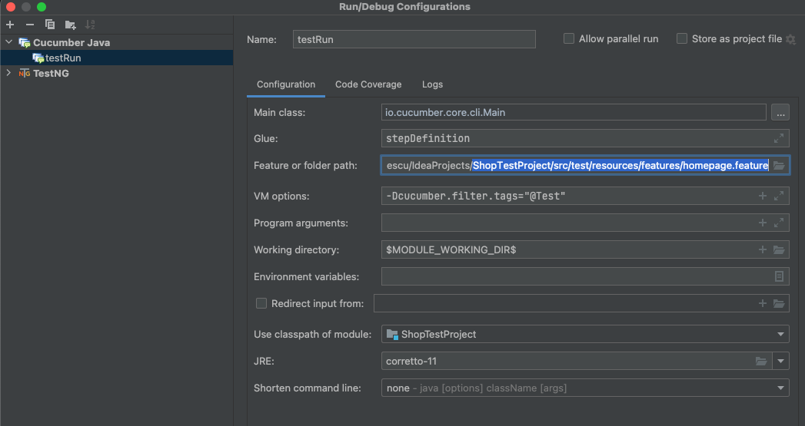
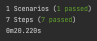

# Shop Test Project

## Summary

    This covers the creation of the framework

## Tech stack

    * Java
    * Maven
    * Cucumber
    * Selenium

## Local installation

    * Open pom.xml in Intellij IDEA IDE, wait for all dependencies to download
    * Install Cucumber and Gherkin plugins

## Running tests

    * From Configurations > choose TestNG
    * Class: cucumber.runner.TestRunner
    * Use classpath of module the <project folder>
    * Save configuration name as desired
    * Add @test as tags above the tests in order to run in the feature file
    * Add a Cucumber test run (note that is not generating any report)
    * 
    * 

## Test Report

    * Can be found in the target/tests after running
    * Navigate to the report and open it in the browser